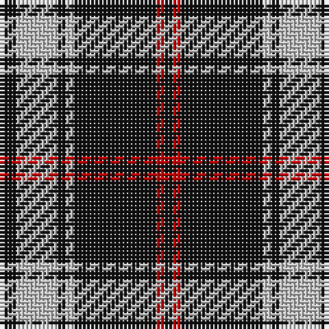

The parent of this is [Lundy Reform (Fashion)](/tartans/k/4/n10/k2/n2/k20/r2/k/2/)

This was sourced from tartans-authority.  It is a [7 stripes tartan](/stripes/stripes7/).

Original link http://www.tartansauthority.com/tartan-ferret/display/5515/

## Thread count
K/4 N10 K2 N2 K20 R2 K/2

## Palette
Each colour and its ΔE from the base-6 reference it is a variant of.

| Colour | Shade | Base | ΔE (OKLab) |
|---|---|---|---|
| K |  `#101010` | K  | 0.17 |
| N |  `#C0C0C0` | W  | 0.16 |
| R |  `#C80000` | R  | 0.00 |

# Sample pattern

ID: /variants/k/4/n10/k2/n2/k20/r2/k/2-k101010-nc0c0c0-rc80000/
