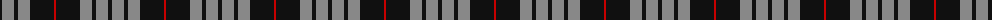
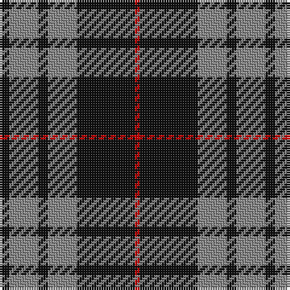

The parent of this is [MacSween, Black (Personal)](/tartans/k/4/n12/k4/n12/k24/r/2/)

This was sourced from tartans-authority.  It is a [6 stripes tartan](/stripes/stripes6/).

Original link http://www.tartansauthority.com/tartan-ferret/display/7903/

## Thread count
K/4 N12 K4 N12 K24 R/2

## Palette
Each colour and its ΔE from the base-6 reference it is a variant of.

| Colour | Shade | Base | ΔE (OKLab) |
|---|---|---|---|
| K |  `#101010` | K  | 0.17 |
| N |  `#888888` | R  | 0.24 |
| R |  `#C80000` | R  | 0.00 |

# Sample pattern

ID: /variants/k/4/n12/k4/n12/k24/r/2-k101010-n888888-rc80000/
