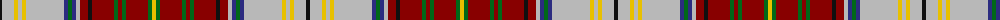

The parent of this is [Harmon Dress (Personal)](/tartans/k/4/n12/y4/n4/y4/n38/db4/g4/db4/n4/dr8/k4/dr22/g4/dr4/g4/dr22/g4/y/4/)

This was sourced from tartans-authority.  It is a [19 stripes tartan](/stripes/stripes19/).

Original link http://www.tartansauthority.com/tartan-ferret/display/10020/

## Thread count
K/4 N12 Y4 N4 Y4 N38 DB4 G4 DB4 N4 DR8 K4 DR22 G4 DR4 G4 DR22 G4 Y/4

## Palette
Each colour and its ΔE from the base-6 reference it is a variant of.

| Colour | Shade | Base | ΔE (OKLab) |
|---|---|---|---|
| DB |  `#2C2C80` | B  | 0.05 |
| DR |  `#880000` | R  | 0.14 |
| G |  `#006818` | G  | 0.02 |
| K |  `#101010` | K  | 0.17 |
| N |  `#B8B8B8` | Y  | 0.17 |
| Y |  `#E8C000` | Y  | 0.00 |

ID: /variants/k/4/n12/y4/n4/y4/n38/db4/g4/db4/n4/dr8/k4/dr22/g4/dr4/g4/dr22/g4/y/4-db2c2c80-dr880000-g006818-k101010-nb8b8b8-ye8c000/
