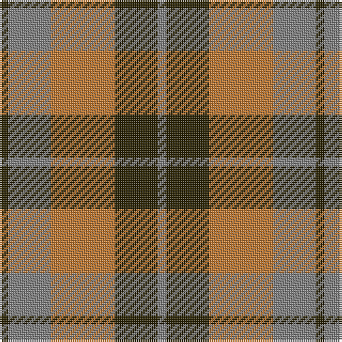

The parent of this is [Harmony 8](/tartans/k/4/n20/do30/k20/n/4/)

This was sourced from register-of-tartans.  It is a [5 stripes tartan](/stripes/stripes5/).

Original link https://www.tartanregister.gov.uk/tartanDetails.aspx?ref=1612

## Thread count
K/4 N20 DO30 K20 N/4

## Palette
Each colour and its ΔE from the base-6 reference it is a variant of.

| Colour | Shade | Base | ΔE (OKLab) |
|---|---|---|---|
| DO |  `#BE7832` | R  | 0.17 |
| K |  `#2A2303` | B  | 0.21 |
| N |  `#808080` | G  | 0.22 |

# Sample pattern

ID: /variants/k/4/n20/do30/k20/n/4-dobe7832-k2a2303-n808080/
