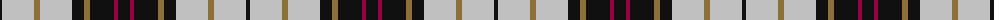

The parent of this is [MacMillan](/tartans/k/4/n32/lt6/n32/k12/lt6/k24/r4/k/12/)

This was sourced from register-of-tartans.  It is a [9 stripes tartan](/stripes/stripes9/).

Original link https://www.tartanregister.gov.uk/tartanDetails.aspx?ref=5288

## Thread count
K/4 N32 LT6 N32 K12 LT6 K24 R4 K/12

## Palette
Each colour and its ΔE from the base-6 reference it is a variant of.

| Colour | Shade | Base | ΔE (OKLab) |
|---|---|---|---|
| K |  `#101010` | K  | 0.17 |
| LT |  `#8C7038` | G  | 0.18 |
| N |  `#C0C0C0` | W  | 0.16 |
| R |  `#980044` | R  | 0.12 |

ID: /variants/k/4/n32/lt6/n32/k12/lt6/k24/r4/k/12-k101010-lt8c7038-nc0c0c0-r980044/
