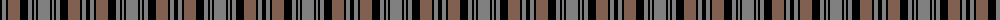

The parent of this is [Tyndrum](/tartans/k/4/n4/k2/lt12/k8/n4/k2/n2/k2/n/12/)

This was sourced from weddslist.  It is a [10 stripes tartan](/stripes/stripes10/).

Original link http://www.weddslist.com/cgi-bin/tartans/pg.pl?source=sts

## Thread count
K/4 N4 K2 LT12 K8 N4 K2 N2 K2 N/12

## Palette
Each colour and its ΔE from the base-6 reference it is a variant of.

| Colour | Shade | Base | ΔE (OKLab) |
|---|---|---|---|
| K |  `#000000` | K  | 0.00 |
| LT |  `#806050` | R  | 0.17 |
| N |  `#808080` | G  | 0.22 |

ID: /variants/k/4/n4/k2/lt12/k8/n4/k2/n2/k2/n/12-k000000-lt806050-n808080/
