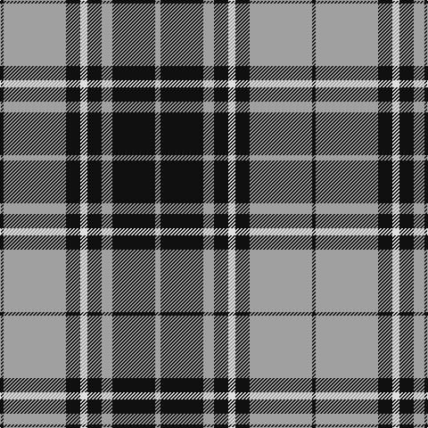

The parent of this is [Nowell/Noel 1951 (Name)](/tartans/k/4/n70/k16/ln8/k16/n12/k48/n/6/)

This was sourced from tartans-authority.  It is a [8 stripes tartan](/stripes/stripes8/).

Original link http://www.tartansauthority.com/tartan-ferret/display/8231/

## Thread count
K/4 N70 K16 LN8 K16 N12 K48 N/6

## Palette
Each colour and its ΔE from the base-6 reference it is a variant of.

| Colour | Shade | Base | ΔE (OKLab) |
|---|---|---|---|
| K |  `#101010` | K  | 0.17 |
| LN |  `#E0E0E0` | W  | 0.06 |
| N |  `#A0A0A0` | Y  | 0.20 |

# Sample pattern

ID: /variants/k/4/n70/k16/ln8/k16/n12/k48/n/6-k101010-lne0e0e0-na0a0a0/
