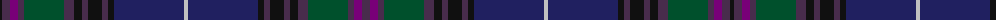

The parent of this is [Spirit of Bannockburn Fashion Tartan Tartan Number: 3445. Earliest known date: 2000 Designed by Lochcarron of Scotland for ACS Clothing of Glasgow (0141 766 2600). Original name was 'Scotland the Brave' but changed to Spirit of Bannockburn by Lochcarron. See products available Copyright © Blair Urquhart, Comrie, 2015](/tartans/k/4/n8/p8/n6/g40/n10/k8/n6/k14/n6/k6/db70/na4/db70/k6/n6/k14/n6/k8/n10/g40/n6/p8/n/8/)

This was sourced from house-of-tartan.  It is a [24 stripes tartan](/stripes/stripes24/).

Original link http://www.house-of-tartan.scotland.net/house/TartanViewjs.asp?colr=Def&tnam=3445

## Thread count
K/4 N8 P8 N6 G40 N10 K8 N6 K14 N6 K6 DB70 Na4 DB70 K6 N6 K14 N6 K8 N10 G40 N6 P8 N/8

## Palette
Each colour and its ΔE from the base-6 reference it is a variant of.

| Colour | Shade | Base | ΔE (OKLab) |
|---|---|---|---|
| DB |  `#202060` | B  | 0.11 |
| DR |  `#680028` | B  | 0.20 |
| G |  `#00502C` | G  | 0.08 |
| K |  `#101010` | K  | 0.17 |
| N |  `#482C4C` | B  | 0.11 |
| Na |  `#C0C0C0` | W  | 0.16 |
| P |  `#780078` | B  | 0.16 |

ID: /variants/k/4/n8/p8/n6/g40/n10/k8/n6/k14/n6/k6/db70/na4/db70/k6/n6/k14/n6/k8/n10/g40/n6/p8/n/8-db202060-dr680028-g00502c-k101010-n482c4c-nac0c0c0-p780078/
