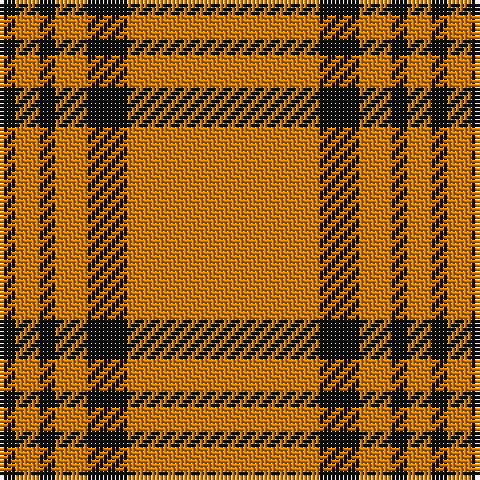

The parent of this is [Schranz-Gritte (Corporate)](/tartans/k/4/o6/k4/o8/k10/o/48/)

This was sourced from tartans-authority.  It is a [6 stripes tartan](/stripes/stripes6/).

Original link http://www.tartansauthority.com/tartan-ferret/display/3074/

## Thread count
K/4 O6 K4 O8 K10 O/48

## Palette
Each colour and its ΔE from the base-6 reference it is a variant of.

| Colour | Shade | Base | ΔE (OKLab) |
|---|---|---|---|
| K |  `#101010` | K  | 0.17 |
| O |  `#D87C00` | Y  | 0.17 |

# Sample pattern

ID: /variants/k/4/o6/k4/o8/k10/o/48-k101010-od87c00/
