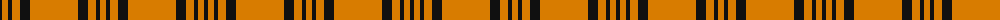

The parent of this is [Schranz-Gritte](/tartans/k/4/o6/k4/o8/k10/o48/k10/o8/k4/o/6/)

This was sourced from register-of-tartans.  It is a [10 stripes tartan](/stripes/stripes10/).

Original link https://www.tartanregister.gov.uk/tartanDetails.aspx?ref=5249

## Thread count
K/4 O6 K4 O8 K10 O48 K10 O8 K4 O/6

## Palette
Each colour and its ΔE from the base-6 reference it is a variant of.

| Colour | Shade | Base | ΔE (OKLab) |
|---|---|---|---|
| G |  `#006818` | G  | 0.02 |
| K |  `#101010` | K  | 0.17 |
| O |  `#D87C00` | Y  | 0.17 |

ID: /variants/k/4/o6/k4/o8/k10/o48/k10/o8/k4/o/6-g006818-k101010-od87c00/
