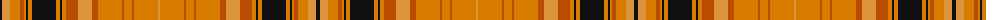

The parent of this is [Highland Aircraft](/tartans/k/4/oa8/o10/do4/o2/k2/o4/k24/o4/k2/o4/do12/oa14/do6/o24/do2/o8/do2/o24/oa/2/)

This was sourced from register-of-tartans.  It is a [20 stripes tartan](/stripes/stripes20/).

Original link https://www.tartanregister.gov.uk/tartanDetails.aspx?ref=11006

## Thread count
K/4 Oa8 O10 DO4 O2 K2 O4 K24 O4 K2 O4 DO12 Oa14 DO6 O24 DO2 O8 DO2 O24 Oa/2

## Palette
Each colour and its ΔE from the base-6 reference it is a variant of.

| Colour | Shade | Base | ΔE (OKLab) |
|---|---|---|---|
| DO |  `#B84C00` | R  | 0.08 |
| K |  `#101010` | K  | 0.17 |
| O |  `#D87C00` | Y  | 0.17 |
| Oa |  `#DC943C` | Y  | 0.12 |

ID: /variants/k/4/oa8/o10/do4/o2/k2/o4/k24/o4/k2/o4/do12/oa14/do6/o24/do2/o8/do2/o24/oa/2-dob84c00-k101010-od87c00-oadc943c/
