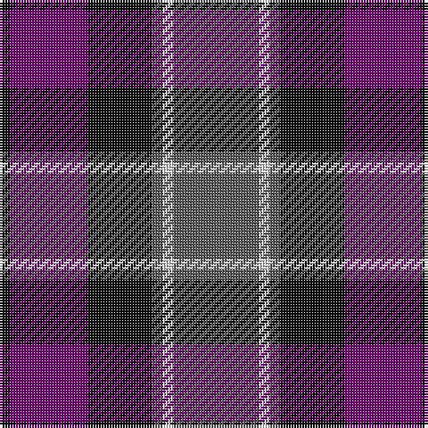

The parent of this is [Grammar School at Leeds (School)](/tartans/k/4/p29/k24/n4/ln4/n/32/)

This was sourced from tartans-authority.  It is a [6 stripes tartan](/stripes/stripes6/).

Original link http://www.tartansauthority.com/tartan-ferret/display/8067/

## Thread count
K/4 P29 K24 N4 LN4 N/32

## Palette
Each colour and its ΔE from the base-6 reference it is a variant of.

| Colour | Shade | Base | ΔE (OKLab) |
|---|---|---|---|
| K |  `#101010` | K  | 0.17 |
| LN |  `#E0E0E0` | W  | 0.06 |
| N |  `#5C5C5C` | B  | 0.14 |
| P |  `#780078` | B  | 0.16 |

# Sample pattern

ID: /variants/k/4/p29/k24/n4/ln4/n/32-k101010-lne0e0e0-n5c5c5c-p780078/
