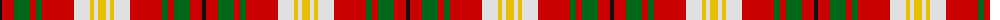

The parent of this is [Carolyn Melieres Family Tartan Tartan Number: 1171. Earliest known date: 1966 A sample of this tartan was recorded by the Scottish Tartans Society during the period 1970 to 1990. See products available Copyright © Blair Urquhart, Comrie, 2015](/tartans/k/4/r12/g16/r6/g6/r32/ln16/y4/ln4/y/8/)

This was sourced from house-of-tartan.  It is a [10 stripes tartan](/stripes/stripes10/).

Original link http://www.house-of-tartan.scotland.net/house/TartanViewjs.asp?colr=Def&tnam=1171

## Thread count
K/4 R12 G16 R6 G6 R32 LN16 Y4 LN4 Y/8

## Palette
Each colour and its ΔE from the base-6 reference it is a variant of.

| Colour | Shade | Base | ΔE (OKLab) |
|---|---|---|---|
| G |  `#006818` | G  | 0.02 |
| K |  `#101010` | K  | 0.17 |
| LN |  `#E0E0E0` | W  | 0.06 |
| R |  `#C80000` | R  | 0.00 |
| Y |  `#E8C000` | Y  | 0.00 |

ID: /variants/k/4/r12/g16/r6/g6/r32/ln16/y4/ln4/y/8-g006818-k101010-lne0e0e0-rc80000-ye8c000/
