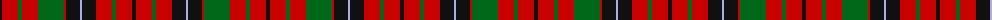

The parent of this is [Nicolson (Lochcarron)](/tartans/k/4/r16/g4/r16/g26/r2/k14/lp2/k14/r16/g4/r16/k/4/)

This was sourced from register-of-tartans.  It is a [13 stripes tartan](/stripes/stripes13/).

Original link https://www.tartanregister.gov.uk/tartanDetails.aspx?ref=3137

## Thread count
K/4 R16 G4 R16 G26 R2 K14 LP2 K14 R16 G4 R16 K/4

## Palette
Each colour and its ΔE from the base-6 reference it is a variant of.

| Colour | Shade | Base | ΔE (OKLab) |
|---|---|---|---|
| DG |  `#003820` | G  | 0.16 |
| G |  `#006818` | G  | 0.02 |
| K |  `#101010` | K  | 0.17 |
| LP |  `#A8ACE8` | W  | 0.22 |
| R |  `#C80000` | R  | 0.00 |

ID: /variants/k/4/r16/g4/r16/g26/r2/k14/lp2/k14/r16/g4/r16/k/4-dg003820-g006818-k101010-lpa8ace8-rc80000/
