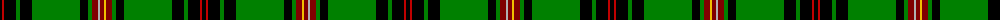

The parent of this is [Kinnear, Pilette of](/tartans/k/4/r2/k12/g4/k12/g48/k8/g4/dr6/n2/dr4/y2/dr6/g4/k8/g48/k12/g4/k12/r2/k/4/)

This was sourced from weddslist.  It is a [21 stripes tartan](/stripes/stripes21/).

Original link http://www.weddslist.com/cgi-bin/tartans/pg.pl?source=sts

## Thread count
K/4 R2 K12 G4 K12 G48 K8 G4 DR6 N2 DR4 Y2 DR6 G4 K8 G48 K12 G4 K12 R2 K/4

## Palette
Each colour and its ΔE from the base-6 reference it is a variant of.

| Colour | Shade | Base | ΔE (OKLab) |
|---|---|---|---|
| DR |  `#800000` | R  | 0.16 |
| G |  `#008000` | G  | 0.09 |
| K |  `#000000` | K  | 0.00 |
| N |  `#B0B0B0` | Y  | 0.18 |
| R |  `#C00000` | R  | 0.02 |
| Y |  `#F0C000` | Y  | 0.01 |

ID: /variants/k/4/r2/k12/g4/k12/g48/k8/g4/dr6/n2/dr4/y2/dr6/g4/k8/g48/k12/g4/k12/r2/k/4-dr800000-g008000-k000000-nb0b0b0-rc00000-yf0c000/
