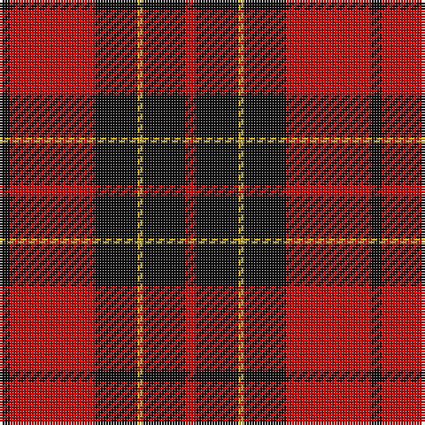

The parent of this is [Brodie (Clan)](/tartans/k/4/r32/k16/y2/k16/r/4/)

This was sourced from tartans-authority.  It is a [6 stripes tartan](/stripes/stripes6/).

Original link http://www.tartansauthority.com/tartan-ferret/display/1193/

## Thread count
K/4 R32 K16 Y2 K16 R/4

## Palette
Each colour and its ΔE from the base-6 reference it is a variant of.

| Colour | Shade | Base | ΔE (OKLab) |
|---|---|---|---|
| K |  `#101010` | K  | 0.17 |
| R |  `#C80000` | R  | 0.00 |
| Y |  `#D8B000` | Y  | 0.05 |

# Sample pattern

ID: /variants/k/4/r32/k16/y2/k16/r/4-k101010-rc80000-yd8b000/
