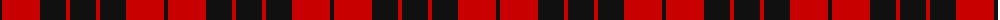

The parent of this is [MacLeod of Raasay (HSL) (Clan)](/tartans/k/4/r38/k26/r4/k/26/)

This was sourced from tartans-authority.  It is a [5 stripes tartan](/stripes/stripes5/).

Original link http://www.tartansauthority.com/tartan-ferret/display/1172/

## Thread count
K/4 R38 K26 R4 K/26

## Palette
Each colour and its ΔE from the base-6 reference it is a variant of.

| Colour | Shade | Base | ΔE (OKLab) |
|---|---|---|---|
| K |  `#101010` | K  | 0.17 |
| R |  `#C80000` | R  | 0.00 |

# Sample pattern

ID: /variants/k/4/r38/k26/r4/k/26-k101010-rc80000/
