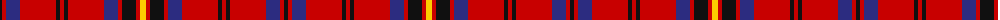

The parent of this is [Brad Majors (Fashion)](/tartans/k/4/r4/db14/r36/k4/r4/k4/r36/db14/r4/k14/r4/y/6/)

This was sourced from tartans-authority.  It is a [13 stripes tartan](/stripes/stripes13/).

Original link http://www.tartansauthority.com/tartan-ferret/display/10406/

## Thread count
K/4 R4 DB14 R36 K4 R4 K4 R36 DB14 R4 K14 R4 Y/6

## Palette
Each colour and its ΔE from the base-6 reference it is a variant of.

| Colour | Shade | Base | ΔE (OKLab) |
|---|---|---|---|
| DB |  `#2C2C80` | B  | 0.05 |
| K |  `#101010` | K  | 0.17 |
| R |  `#C80000` | R  | 0.00 |
| Y |  `#FCCC00` | Y  | 0.04 |

ID: /variants/k/4/r4/db14/r36/k4/r4/k4/r36/db14/r4/k14/r4/y/6-db2c2c80-k101010-rc80000-yfccc00/
