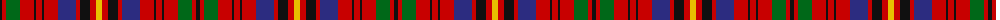

The parent of this is [Prince Charles Plaid Tartan Tartan Number: 1170. Earliest known date: 1893 'Old and Rare Scottish Tartans' (1893), contains a selection of forty five setts, woven in silk, of special interest or antiquity. Many of the illustrated tartans owe their present day popularity to the publication of this work. The author was D. W. Stewart. See products available Copyright © Blair Urquhart, Comrie, 2015](/tartans/k/4/r4/g14/r14/k2/r6/k2/r14/db18/r4/k10/r6/y/6/)

This was sourced from house-of-tartan.  It is a [13 stripes tartan](/stripes/stripes13/).

Original link http://www.house-of-tartan.scotland.net/house/TartanViewjs.asp?colr=Def&tnam=1170

## Thread count
K/4 R4 G14 R14 K2 R6 K2 R14 DB18 R4 K10 R6 Y/6

## Palette
Each colour and its ΔE from the base-6 reference it is a variant of.

| Colour | Shade | Base | ΔE (OKLab) |
|---|---|---|---|
| DB |  `#2C2C80` | B  | 0.05 |
| G |  `#006818` | G  | 0.02 |
| K |  `#101010` | K  | 0.17 |
| R |  `#C80000` | R  | 0.00 |
| Y |  `#E8C000` | Y  | 0.00 |

ID: /variants/k/4/r4/g14/r14/k2/r6/k2/r14/db18/r4/k10/r6/y/6-db2c2c80-g006818-k101010-rc80000-ye8c000/
