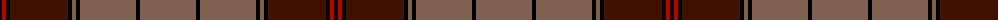

The parent of this is [Ulster](/tartans/k/4/r4/k4/dr58/k4/lt4/k4/lt56/k4/lt/56/)

This was sourced from weddslist.  It is a [10 stripes tartan](/stripes/stripes10/).

Original link http://www.weddslist.com/cgi-bin/tartans/pg.pl?source=sts

## Thread count
K/4 R4 K4 DR58 K4 LT4 K4 LT56 K4 LT/56

## Palette
Each colour and its ΔE from the base-6 reference it is a variant of.

| Colour | Shade | Base | ΔE (OKLab) |
|---|---|---|---|
| DR |  `#401000` | B  | 0.23 |
| K |  `#000000` | K  | 0.00 |
| LT |  `#806050` | R  | 0.17 |
| R |  `#C00000` | R  | 0.02 |

ID: /variants/k/4/r4/k4/dr58/k4/lt4/k4/lt56/k4/lt/56-dr401000-k000000-lt806050-rc00000/
