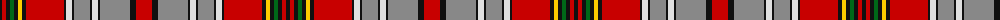

The parent of this is [Canadian Dental Association (Corp.)](/tartans/k/4/r4/k4/g4/k4/y4/k4/r38/k2/ln6/k2/n16/k2/ln6/k2/n30/k6/r/16/)

This was sourced from tartans-authority.  It is a [18 stripes tartan](/stripes/stripes18/).

Original link http://www.tartansauthority.com/tartan-ferret/display/10403/

## Thread count
K/4 R4 K4 G4 K4 Y4 K4 R38 K2 LN6 K2 N16 K2 LN6 K2 N30 K6 R/16

## Palette
Each colour and its ΔE from the base-6 reference it is a variant of.

| Colour | Shade | Base | ΔE (OKLab) |
|---|---|---|---|
| G |  `#006818` | G  | 0.02 |
| K |  `#101010` | K  | 0.17 |
| LN |  `#E0E0E0` | W  | 0.06 |
| N |  `#888888` | R  | 0.24 |
| R |  `#C80000` | R  | 0.00 |
| Y |  `#FCCC00` | Y  | 0.04 |

ID: /variants/k/4/r4/k4/g4/k4/y4/k4/r38/k2/ln6/k2/n16/k2/ln6/k2/n30/k6/r/16-g006818-k101010-lne0e0e0-n888888-rc80000-yfccc00/
