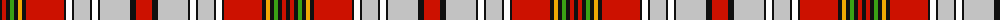

The parent of this is [Canadian Dental Association](/tartans/k/4/r4/k4/g4/k4/y4/k4/r38/k2/w6/k2/n16/k2/w6/k2/n30/k6/r/16/)

This was sourced from register-of-tartans.  It is a [18 stripes tartan](/stripes/stripes18/).

Original link https://www.tartanregister.gov.uk/tartanDetails.aspx?ref=10403

## Thread count
K/4 R4 K4 G4 K4 Y4 K4 R38 K2 W6 K2 N16 K2 W6 K2 N30 K6 R/16

## Palette
Each colour and its ΔE from the base-6 reference it is a variant of.

| Colour | Shade | Base | ΔE (OKLab) |
|---|---|---|---|
| G |  `#3AA215` | G  | 0.20 |
| K |  `#101010` | K  | 0.17 |
| N |  `#C2C2C2` | W  | 0.15 |
| R |  `#CC1100` | R  | 0.01 |
| W |  `#FFFFFF` | W  | 0.03 |
| Y |  `#F0A804` | Y  | 0.06 |

ID: /variants/k/4/r4/k4/g4/k4/y4/k4/r38/k2/w6/k2/n16/k2/w6/k2/n30/k6/r/16-g3aa215-k101010-nc2c2c2-rcc1100-wffffff-yf0a804/
