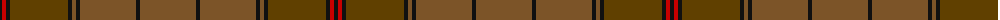

The parent of this is [Ulster (Peat) (District](/tartans/k/4/r4/k4/t58/k4/ta4/k4/ta56/k4/ta/56/)

This was sourced from tartans-authority.  It is a [10 stripes tartan](/stripes/stripes10/).

Original link http://www.tartansauthority.com/tartan-ferret/display/1196/

## Thread count
K/4 R4 K4 T58 K4 Ta4 K4 Ta56 K4 Ta/56

## Palette
Each colour and its ΔE from the base-6 reference it is a variant of.

| Colour | Shade | Base | ΔE (OKLab) |
|---|---|---|---|
| K |  `#101010` | K  | 0.17 |
| R |  `#C80000` | R  | 0.00 |
| T |  `#604000` | G  | 0.14 |
| Ta |  `#7C5428` | G  | 0.16 |

ID: /variants/k/4/r4/k4/t58/k4/ta4/k4/ta56/k4/ta/56-k101010-rc80000-t604000-ta7c5428/
