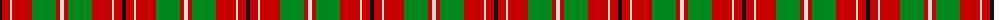
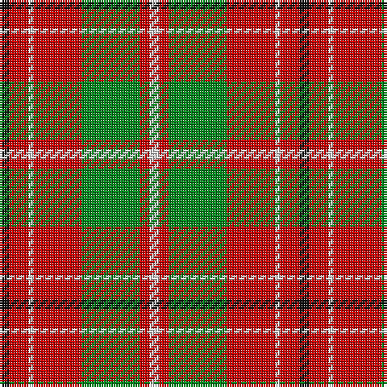

The parent of this is [Starr (1978) (Name)](/tartans/k/4/r8/ln2/r20/g24/r4/ln/4/)

This was sourced from tartans-authority.  It is a [7 stripes tartan](/stripes/stripes7/).

Original link http://www.tartansauthority.com/tartan-ferret/display/8223/

## Thread count
K/4 R8 LN2 R20 G24 R4 LN/4

## Palette
Each colour and its ΔE from the base-6 reference it is a variant of.

| Colour | Shade | Base | ΔE (OKLab) |
|---|---|---|---|
| G |  `#00881C` | G  | 0.11 |
| K |  `#101010` | K  | 0.17 |
| LN |  `#E0E0E0` | W  | 0.06 |
| R |  `#C80000` | R  | 0.00 |

# Sample pattern

ID: /variants/k/4/r8/ln2/r20/g24/r4/ln/4-g00881c-k101010-lne0e0e0-rc80000/
