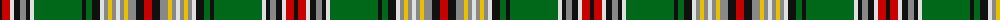

The parent of this is [Murtaugh Hunting (Name)](/tartans/k/4/r8/ln4/k6/n6/k4/ln4/g48/k4/g6/k8/ln4/n4/y4/n4/ln4/n4/y4/n8/k8/r/8/)

This was sourced from tartans-authority.  It is a [21 stripes tartan](/stripes/stripes21/).

Original link http://www.tartansauthority.com/tartan-ferret/display/5818/

## Thread count
K/4 R8 LN4 K6 N6 K4 LN4 G48 K4 G6 K8 LN4 N4 Y4 N4 LN4 N4 Y4 N8 K8 R/8

## Palette
Each colour and its ΔE from the base-6 reference it is a variant of.

| Colour | Shade | Base | ΔE (OKLab) |
|---|---|---|---|
| G |  `#006818` | G  | 0.02 |
| K |  `#101010` | K  | 0.17 |
| LN |  `#E0E0E0` | W  | 0.06 |
| N |  `#888888` | R  | 0.24 |
| R |  `#C80000` | R  | 0.00 |
| Y |  `#E8C000` | Y  | 0.00 |

ID: /variants/k/4/r8/ln4/k6/n6/k4/ln4/g48/k4/g6/k8/ln4/n4/y4/n4/ln4/n4/y4/n8/k8/r/8-g006818-k101010-lne0e0e0-n888888-rc80000-ye8c000/
