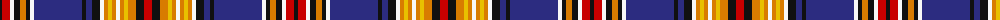

The parent of this is [Murtaugh (Name)](/tartans/k/4/r8/w4/k6/o6/k4/w4/db48/k4/db6/k8/w4/o4/y4/o4/w4/o4/y4/o8/k8/r/8/)

This was sourced from tartans-authority.  It is a [21 stripes tartan](/stripes/stripes21/).

Original link http://www.tartansauthority.com/tartan-ferret/display/4022/

## Thread count
K/4 R8 W4 K6 O6 K4 W4 DB48 K4 DB6 K8 W4 O4 Y4 O4 W4 O4 Y4 O8 K8 R/8

## Palette
Each colour and its ΔE from the base-6 reference it is a variant of.

| Colour | Shade | Base | ΔE (OKLab) |
|---|---|---|---|
| DB |  `#2C2C80` | B  | 0.05 |
| K |  `#101010` | K  | 0.17 |
| O |  `#D87C00` | Y  | 0.17 |
| R |  `#C80000` | R  | 0.00 |
| W |  `#F8F8F8` | W  | 0.01 |
| Y |  `#E8C000` | Y  | 0.00 |

ID: /variants/k/4/r8/w4/k6/o6/k4/w4/db48/k4/db6/k8/w4/o4/y4/o4/w4/o4/y4/o8/k8/r/8-db2c2c80-k101010-od87c00-rc80000-wf8f8f8-ye8c000/
