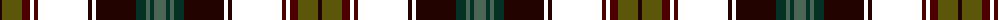

The parent of this is [Strathtay District Tartan Tartan Number: 10115. Earliest known date: 26/11/2009 Strathtay, the valley of the River Tay, Scotland’s longest river, cuts its way majestically through from the Highlands down into Central Scotland, finally passing through Perth and Dundee, and flowing out into the North Sea. The tartan is influenced by the dramatic autumn colours of the wooded banks in the upper reaches of the river valley, with the olive greens and reds of the leaves cut by the silver blue and the green of the river as it flows swiftly through to the more pastoral waters of the estuary. See products available Copyright © Blair Urquhart, Comrie, 2015](/tartans/k/4/t20/dr8/sr4/dr4/sr50/k4/sr4/k40/dg10/n4/dg4/n/12/)

This was sourced from house-of-tartan.  It is a [13 stripes tartan](/stripes/stripes13/).

Original link http://www.house-of-tartan.scotland.net/house/TartanViewjs.asp?colr=Def&tnam=10115

## Thread count
K/4 T20 DR8 SR4 DR4 SR50 K4 SR4 K40 DG10 N4 DG4 N/12

## Palette
Each colour and its ΔE from the base-6 reference it is a variant of.

| Colour | Shade | Base | ΔE (OKLab) |
|---|---|---|---|
| DG |  `#033126` | B  | 0.17 |
| DR |  `#4C0000` | B  | 0.24 |
| K |  `#220300` | K  | 0.18 |
| N |  `#4A6753` | G  | 0.11 |
| T |  `#5C560B` | G  | 0.10 |

ID: /variants/k/4/t20/dr8/sr4/dr4/sr50/k4/sr4/k40/dg10/n4/dg4/n/12-dg033126-dr4c0000-k220300-n4a6753-t5c560b/
