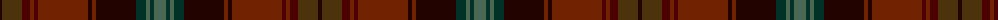

The parent of this is [Strathtay](/tartans/k/4/t20/dr8/ta4/dr4/ta50/k4/ta4/k40/dg10/n4/dg4/n/12/)

This was sourced from register-of-tartans.  It is a [13 stripes tartan](/stripes/stripes13/).

Original link https://www.tartanregister.gov.uk/tartanDetails.aspx?ref=10115

## Thread count
K/4 T20 DR8 Ta4 DR4 Ta50 K4 Ta4 K40 DG10 N4 DG4 N/12

## Palette
Each colour and its ΔE from the base-6 reference it is a variant of.

| Colour | Shade | Base | ΔE (OKLab) |
|---|---|---|---|
| DG |  `#033126` | B  | 0.17 |
| DR |  `#4C0000` | B  | 0.24 |
| K |  `#220300` | K  | 0.18 |
| N |  `#4A6753` | G  | 0.11 |
| T |  `#4C330B` | G  | 0.17 |
| Ta |  `#712201` | R  | 0.18 |

ID: /variants/k/4/t20/dr8/ta4/dr4/ta50/k4/ta4/k40/dg10/n4/dg4/n/12-dg033126-dr4c0000-k220300-n4a6753-t4c330b-ta712201/
