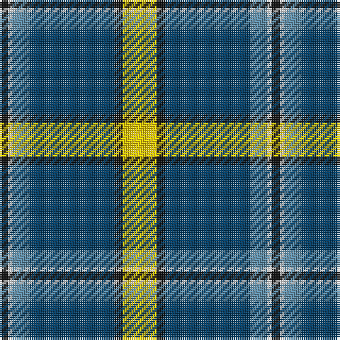

The parent of this is [Solberg-Bell](/tartans/k/4/w2/b8/db40/k4/y/16/)

This was sourced from tartans-authority.  It is a [6 stripes tartan](/stripes/stripes6/).

Original link http://www.tartansauthority.com/tartan-ferret/display/11124/

## Thread count
K/4 W2 B8 DB40 K4 Y/16

## Palette
Each colour and its ΔE from the base-6 reference it is a variant of.

| Colour | Shade | Base | ΔE (OKLab) |
|---|---|---|---|
| B |  `#5C8CA8` | B  | 0.23 |
| DB |  `#003C64` | B  | 0.07 |
| K |  `#101010` | K  | 0.17 |
| W |  `#FCFCFC` | W  | 0.03 |
| Y |  `#FCCC00` | Y  | 0.04 |

# Sample pattern

ID: /variants/k/4/w2/b8/db40/k4/y/16-b5c8ca8-db003c64-k101010-wfcfcfc-yfccc00/
