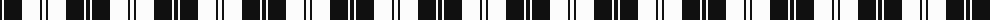
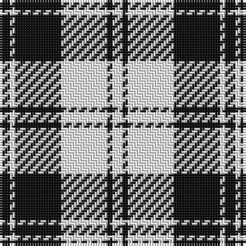

The parent of this is [Erskine Black & White (Clan)](/tartans/k/4/w2/k18/w18/k2/w/4/)

This was sourced from tartans-authority.  It is a [6 stripes tartan](/stripes/stripes6/).

Original link http://www.tartansauthority.com/tartan-ferret/display/1246/

## Thread count
K/4 W2 K18 W18 K2 W/4

## Palette
Each colour and its ΔE from the base-6 reference it is a variant of.

| Colour | Shade | Base | ΔE (OKLab) |
|---|---|---|---|
| K |  `#101010` | K  | 0.17 |
| W |  `#FCFCFC` | W  | 0.03 |

# Sample pattern

ID: /variants/k/4/w2/k18/w18/k2/w/4-k101010-wfcfcfc/
