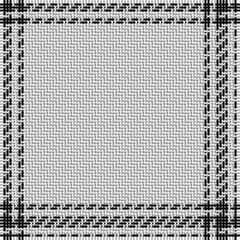

The parent of this is [Covenanter (Fashion)](/tartans/k/4/w2/k2/w/60/)

This was sourced from tartans-authority.  It is a [4 stripes tartan](/stripes/stripes4/).

Original link http://www.tartansauthority.com/tartan-ferret/display/6377/

## Thread count
K/4 W2 K2 W/60

## Palette
Each colour and its ΔE from the base-6 reference it is a variant of.

| Colour | Shade | Base | ΔE (OKLab) |
|---|---|---|---|
| K |  `#101010` | K  | 0.17 |
| W |  `#F8F8F8` | W  | 0.01 |

# Sample pattern

ID: /variants/k/4/w2/k2/w/60-k101010-wf8f8f8/
