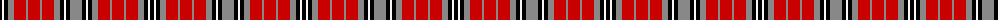

The parent of this is [Sydney (Nova Scotia)](/tartans/k/4/w2/k4/na6/r12/na2/r12/na2/r12/na6/k4/w2/k4/na/12/)

This was sourced from register-of-tartans.  It is a [14 stripes tartan](/stripes/stripes14/).

Original link https://www.tartanregister.gov.uk/tartanDetails.aspx?ref=4057

## Thread count
K/4 W2 K4 Na6 R12 Na2 R12 Na2 R12 Na6 K4 W2 K4 Na/12

## Palette
Each colour and its ΔE from the base-6 reference it is a variant of.

| Colour | Shade | Base | ΔE (OKLab) |
|---|---|---|---|
| B |  `#788CB4` | B  | 0.25 |
| Ba |  `#1474B4` | B  | 0.15 |
| DB |  `#00008C` | B  | 0.13 |
| DR |  `#8C0000` | R  | 0.13 |
| DY |  `#C88C00` | Y  | 0.15 |
| G |  `#007800` | G  | 0.06 |
| K |  `#000000` | K  | 0.00 |
| N |  `#C8C8C8` | W  | 0.13 |
| Na |  `#888888` | R  | 0.24 |
| P |  `#64008C` | B  | 0.13 |
| R |  `#C80000` | R  | 0.00 |
| W |  `#F8F8F8` | W  | 0.01 |

ID: /variants/k/4/w2/k4/na6/r12/na2/r12/na2/r12/na6/k4/w2/k4/na/12-b788cb4-ba1474b4-db00008c-dr8c0000-dyc88c00-g007800-k000000-nc8c8c8-na888888-p64008c-rc80000-wf8f8f8/
