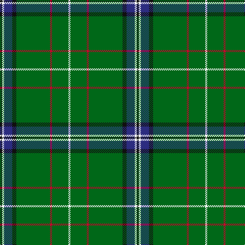

The parent of this is [Sarros (Personal) XX](/tartans/k/4/w4/db16/k8/g66/r4/g32/w/4/)

This was sourced from tartans-authority.  It is a [8 stripes tartan](/stripes/stripes8/).

Original link http://www.tartansauthority.com/tartan-ferret/display/10526/

## Thread count
K/4 W4 DB16 K8 G66 R4 G32 W/4

## Palette
Each colour and its ΔE from the base-6 reference it is a variant of.

| Colour | Shade | Base | ΔE (OKLab) |
|---|---|---|---|
| DB |  `#2C2C80` | B  | 0.05 |
| G |  `#006818` | G  | 0.02 |
| K |  `#101010` | K  | 0.17 |
| R |  `#C8002C` | R  | 0.03 |
| W |  `#FCFCFC` | W  | 0.03 |

# Sample pattern

ID: /variants/k/4/w4/db16/k8/g66/r4/g32/w/4-db2c2c80-g006818-k101010-rc8002c-wfcfcfc/
