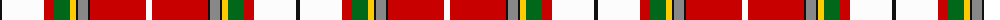

The parent of this is [Cape Breton Polish Society](/tartans/k/4/w42/r10/g16/y6/k2/n10/k2/r56/w/6/)

This was sourced from tartans-authority.  It is a [10 stripes tartan](/stripes/stripes10/).

Original link http://www.tartansauthority.com/tartan-ferret/display/11244/

## Thread count
K/4 W42 R10 G16 Y6 K2 N10 K2 R56 W/6

## Palette
Each colour and its ΔE from the base-6 reference it is a variant of.

| Colour | Shade | Base | ΔE (OKLab) |
|---|---|---|---|
| G |  `#006818` | G  | 0.02 |
| K |  `#101010` | K  | 0.17 |
| N |  `#888888` | R  | 0.24 |
| R |  `#C80000` | R  | 0.00 |
| W |  `#FCFCFC` | W  | 0.03 |
| Y |  `#FCCC00` | Y  | 0.04 |

ID: /variants/k/4/w42/r10/g16/y6/k2/n10/k2/r56/w/6-g006818-k101010-n888888-rc80000-wfcfcfc-yfccc00/
