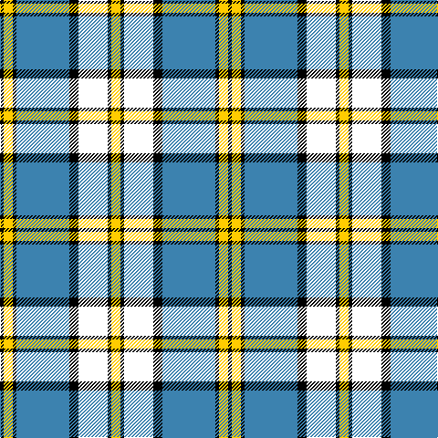

The parent of this is [Children's Wish Foundation of Canada, The](/tartans/k/4/y10/k4/b58/k10/w32/k4/y/10/)

This was sourced from register-of-tartans.  It is a [8 stripes tartan](/stripes/stripes8/).

Original link https://www.tartanregister.gov.uk/tartanDetails.aspx?ref=11074

## Thread count
K/4 Y10 K4 B58 K10 W32 K4 Y/10

## Palette
Each colour and its ΔE from the base-6 reference it is a variant of.

| Colour | Shade | Base | ΔE (OKLab) |
|---|---|---|---|
| B |  `#3C82AF` | B  | 0.20 |
| K |  `#000000` | K  | 0.00 |
| W |  `#FFFFFF` | W  | 0.03 |
| Y |  `#FFCC00` | Y  | 0.05 |

# Sample pattern

ID: /variants/k/4/y10/k4/b58/k10/w32/k4/y/10-b3c82af-k000000-wffffff-yffcc00/
