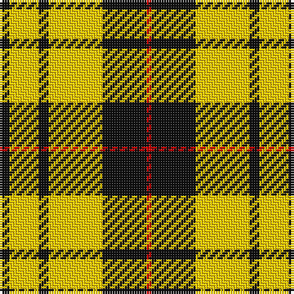

The parent of this is [Porter Drinkers (Commemorative)](/tartans/k/4/y12/k4/y22/k18/r/2/)

This was sourced from tartans-authority.  It is a [6 stripes tartan](/stripes/stripes6/).

Original link http://www.tartansauthority.com/tartan-ferret/display/10512/

## Thread count
K/4 Y12 K4 Y22 K18 R/2

## Palette
Each colour and its ΔE from the base-6 reference it is a variant of.

| Colour | Shade | Base | ΔE (OKLab) |
|---|---|---|---|
| K |  `#101010` | K  | 0.17 |
| R |  `#C80000` | R  | 0.00 |
| Y |  `#FCCC00` | Y  | 0.04 |

# Sample pattern

ID: /variants/k/4/y12/k4/y22/k18/r/2-k101010-rc80000-yfccc00/
