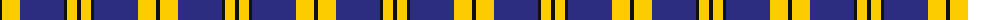

The parent of this is [Stutterheim (Corporate)](/tartans/k/4/y18/db44/k3/y10/k/4/)

This was sourced from tartans-authority.  It is a [6 stripes tartan](/stripes/stripes6/).

Original link http://www.tartansauthority.com/tartan-ferret/display/10572/

## Thread count
K/4 Y18 DB44 K3 Y10 K/4

## Palette
Each colour and its ΔE from the base-6 reference it is a variant of.

| Colour | Shade | Base | ΔE (OKLab) |
|---|---|---|---|
| DB |  `#2C2C80` | B  | 0.05 |
| K |  `#101010` | K  | 0.17 |
| Y |  `#FCCC00` | Y  | 0.04 |

# Sample pattern

ID: /variants/k/4/y18/db44/k3/y10/k/4-db2c2c80-k101010-yfccc00/
