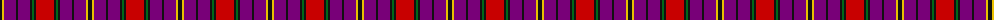

The parent of this is [Red Chapeau (Corporate)](/tartans/k/4/y2/p12/k2/p12/k2/g2/k2/r/18/)

This was sourced from tartans-authority.  It is a [9 stripes tartan](/stripes/stripes9/).

Original link http://www.tartansauthority.com/tartan-ferret/display/7212/

## Thread count
K/4 Y2 P12 K2 P12 K2 G2 K2 R/18

## Palette
Each colour and its ΔE from the base-6 reference it is a variant of.

| Colour | Shade | Base | ΔE (OKLab) |
|---|---|---|---|
| G |  `#006818` | G  | 0.02 |
| K |  `#101010` | K  | 0.17 |
| P |  `#780078` | B  | 0.16 |
| R |  `#C80000` | R  | 0.00 |
| Y |  `#E8C000` | Y  | 0.00 |

ID: /variants/k/4/y2/p12/k2/p12/k2/g2/k2/r/18-g006818-k101010-p780078-rc80000-ye8c000/
