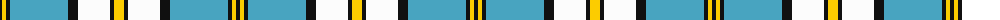

The parent of this is [Children's Wish Foundation of Canada](/tartans/k/4/y4/k4/b58/k10/w32/k4/y/10/)

This was sourced from tartans-authority.  It is a [8 stripes tartan](/stripes/stripes8/).

Original link http://www.tartansauthority.com/tartan-ferret/display/11074/

## Thread count
K/4 Y4 K4 B58 K10 W32 K4 Y/10

## Palette
Each colour and its ΔE from the base-6 reference it is a variant of.

| Colour | Shade | Base | ΔE (OKLab) |
|---|---|---|---|
| B |  `#48A4C0` | Y  | 0.28 |
| K |  `#101010` | K  | 0.17 |
| W |  `#FCFCFC` | W  | 0.03 |
| Y |  `#FCCC00` | Y  | 0.04 |

# Sample pattern

ID: /variants/k/4/y4/k4/b58/k10/w32/k4/y/10-b48a4c0-k101010-wfcfcfc-yfccc00/
