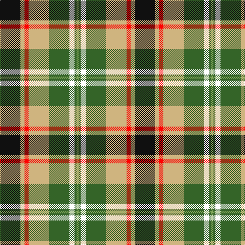

The parent of this is [Hackett William (Coatbridge) Hunting (Personal)](/tartans/k/40/lga8/r8/lga40/g40/w10/g4/lg/4/)

This was sourced from register-of-tartans.  It is a [8 stripes tartan](/stripes/stripes8/).

Original link https://www.tartanregister.gov.uk/tartanDetails.aspx?ref=10783

## Thread count
K/40 LGa8 R8 LGa40 G40 W10 G4 LG/4

## Palette
Each colour and its ΔE from the base-6 reference it is a variant of.

| Colour | Shade | Base | ΔE (OKLab) |
|---|---|---|---|
| G |  `#346428` | G  | 0.05 |
| K |  `#101010` | K  | 0.17 |
| LG |  `#86AC5F` | Y  | 0.16 |
| LGa |  `#CFB47F` | Y  | 0.10 |
| R |  `#FF0000` | R  | 0.11 |
| W |  `#FFFFFF` | W  | 0.03 |

# Sample pattern

ID: /variants/k/40/lga8/r8/lga40/g40/w10/g4/lg/4-g346428-k101010-lg86ac5f-lgacfb47f-rff0000-wffffff/
