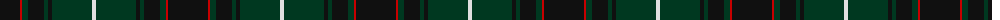
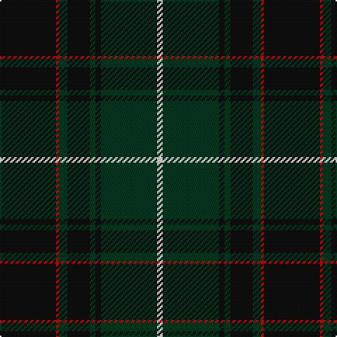

The parent of this is [Scottish Chieftain (Universal)](/tartans/k/40/r2/dg6/k16/dg4/k4/dg40/ln/4/)

This was sourced from tartans-authority.  It is a [8 stripes tartan](/stripes/stripes8/).

Original link http://www.tartansauthority.com/tartan-ferret/display/3978/

## Thread count
K/40 R2 DG6 K16 DG4 K4 DG40 LN/4

## Palette
Each colour and its ΔE from the base-6 reference it is a variant of.

| Colour | Shade | Base | ΔE (OKLab) |
|---|---|---|---|
| DG |  `#003820` | G  | 0.16 |
| K |  `#101010` | K  | 0.17 |
| LN |  `#E0E0E0` | W  | 0.06 |
| R |  `#C80000` | R  | 0.00 |

# Sample pattern

ID: /variants/k/40/r2/dg6/k16/dg4/k4/dg40/ln/4-dg003820-k101010-lne0e0e0-rc80000/
