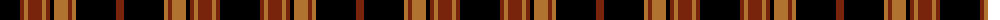

The parent of this is [Black Forest (Fashion)](/tartans/k/40/t4/lt4/t14/lt4/t4/k4/lt14/t4/lt4/k40/t/8/)

This was sourced from tartans-authority.  It is a [12 stripes tartan](/stripes/stripes12/).

Original link http://www.tartansauthority.com/tartan-ferret/display/3694/

## Thread count
K/40 T4 LT4 T14 LT4 T4 K4 LT14 T4 LT4 K40 T/8

## Palette
Each colour and its ΔE from the base-6 reference it is a variant of.

| Colour | Shade | Base | ΔE (OKLab) |
|---|---|---|---|
| K |  `#000000` | K  | 0.00 |
| LT |  `#B07430` | R  | 0.17 |
| T |  `#78240C` | R  | 0.16 |

ID: /variants/k/40/t4/lt4/t14/lt4/t4/k4/lt14/t4/lt4/k40/t/8-k000000-ltb07430-t78240c/
