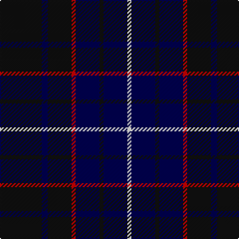

The parent of this is [Inverness Caledonian Thistle F.C. (C](/tartans/k/42/db6/k24/r4/db24/k4/db24/w/4/)

This was sourced from tartans-authority.  It is a [8 stripes tartan](/stripes/stripes8/).

Original link http://www.tartansauthority.com/tartan-ferret/display/5272/

## Thread count
K/42 DB6 K24 R4 DB24 K4 DB24 W/4

## Palette
Each colour and its ΔE from the base-6 reference it is a variant of.

| Colour | Shade | Base | ΔE (OKLab) |
|---|---|---|---|
| DB |  `#000050` | B  | 0.20 |
| K |  `#101010` | K  | 0.17 |
| R |  `#C80000` | R  | 0.00 |
| W |  `#FCFCFC` | W  | 0.03 |

# Sample pattern

ID: /variants/k/42/db6/k24/r4/db24/k4/db24/w/4-db000050-k101010-rc80000-wfcfcfc/
