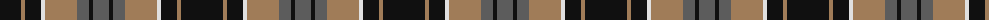

The parent of this is [Ardmore (Fashion)](/tartans/k/42/lt4/k16/ln4/lt32/n12/k4/n/16/)

This was sourced from tartans-authority.  It is a [8 stripes tartan](/stripes/stripes8/).

Original link http://www.tartansauthority.com/tartan-ferret/display/3041/

## Thread count
K/42 LT4 K16 LN4 LT32 N12 K4 N/16

## Palette
Each colour and its ΔE from the base-6 reference it is a variant of.

| Colour | Shade | Base | ΔE (OKLab) |
|---|---|---|---|
| K |  `#101010` | K  | 0.17 |
| LN |  `#E0E0E0` | W  | 0.06 |
| LT |  `#A07C58` | R  | 0.19 |
| N |  `#5C5C5C` | B  | 0.14 |

# Sample pattern

ID: /variants/k/42/lt4/k16/ln4/lt32/n12/k4/n/16-k101010-lne0e0e0-lta07c58-n5c5c5c/
