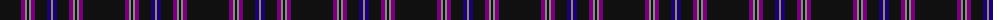

The parent of this is [Clan Inebriated](/tartans/k/42/p4/n2/k2/n2/p4/k12/db4/n/2/)

This was sourced from register-of-tartans.  It is a [9 stripes tartan](/stripes/stripes9/).

Original link https://www.tartanregister.gov.uk/tartanDetails.aspx?ref=5691

## Thread count
K/42 P4 N2 K2 N2 P4 K12 DB4 N/2

## Palette
Each colour and its ΔE from the base-6 reference it is a variant of.

| Colour | Shade | Base | ΔE (OKLab) |
|---|---|---|---|
| DB |  `#1C0070` | B  | 0.14 |
| K |  `#101010` | K  | 0.17 |
| N |  `#888888` | R  | 0.24 |
| P |  `#780078` | B  | 0.16 |

ID: /variants/k/42/p4/n2/k2/n2/p4/k12/db4/n/2-db1c0070-k101010-n888888-p780078/
