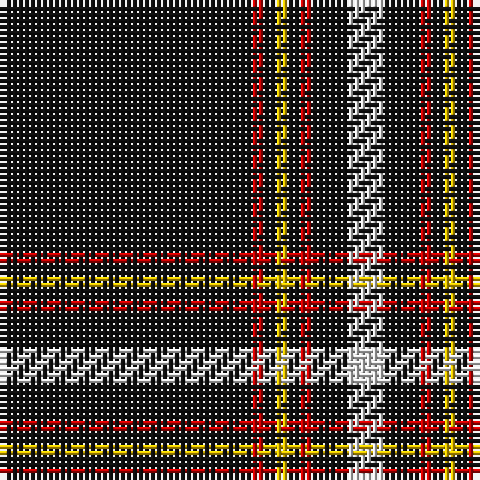

The parent of this is [Black Country (District)](/tartans/k/42/r2/k2/y2/k2/r2/k6/ln/6/)

This was sourced from tartans-authority.  It is a [8 stripes tartan](/stripes/stripes8/).

Original link http://www.tartansauthority.com/tartan-ferret/display/7844/

## Thread count
K/42 R2 K2 Y2 K2 R2 K6 LN/6

## Palette
Each colour and its ΔE from the base-6 reference it is a variant of.

| Colour | Shade | Base | ΔE (OKLab) |
|---|---|---|---|
| K |  `#101010` | K  | 0.17 |
| LN |  `#E0E0E0` | W  | 0.06 |
| R |  `#C80000` | R  | 0.00 |
| Y |  `#E8C000` | Y  | 0.00 |

# Sample pattern

ID: /variants/k/42/r2/k2/y2/k2/r2/k6/ln/6-k101010-lne0e0e0-rc80000-ye8c000/
