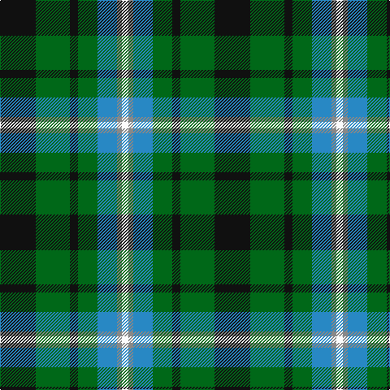

The parent of this is [Disciples of Christ MM (Switzerland)](/tartans/k/44/g42/k10/g24/b24/n6/w/8/)

This was sourced from tartans-authority.  It is a [7 stripes tartan](/stripes/stripes7/).

Original link http://www.tartansauthority.com/tartan-ferret/display/11103/

## Thread count
K/44 G42 K10 G24 B24 N6 W/8

## Palette
Each colour and its ΔE from the base-6 reference it is a variant of.

| Colour | Shade | Base | ΔE (OKLab) |
|---|---|---|---|
| B |  `#2888C4` | B  | 0.21 |
| G |  `#006818` | G  | 0.02 |
| K |  `#101010` | K  | 0.17 |
| N |  `#888888` | R  | 0.24 |
| W |  `#FCFCFC` | W  | 0.03 |

# Sample pattern

ID: /variants/k/44/g42/k10/g24/b24/n6/w/8-b2888c4-g006818-k101010-n888888-wfcfcfc/
