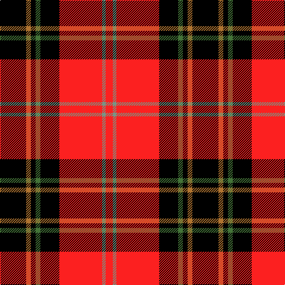

The parent of this is [Dean Brae](/tartans/k/44/lt8/k8/g8/k32/r72/lg6/r/12/)

This was sourced from register-of-tartans.  It is a [8 stripes tartan](/stripes/stripes8/).

Original link https://www.tartanregister.gov.uk/tartanDetails.aspx?ref=902

## Thread count
K/44 LT8 K8 G8 K32 R72 LG6 R/12

## Palette
Each colour and its ΔE from the base-6 reference it is a variant of.

| Colour | Shade | Base | ΔE (OKLab) |
|---|---|---|---|
| G |  `#447438` | G  | 0.09 |
| K |  `#000000` | K  | 0.00 |
| LG |  `#789484` | G  | 0.23 |
| LT |  `#B07430` | R  | 0.17 |
| R |  `#FC2020` | R  | 0.11 |

# Sample pattern

ID: /variants/k/44/lt8/k8/g8/k32/r72/lg6/r/12-g447438-k000000-lg789484-ltb07430-rfc2020/
