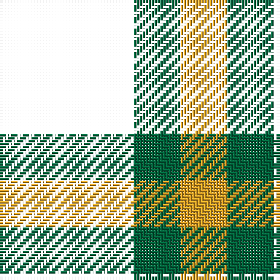

The parent of this is [Zwijnenberg, Frans (Personal)](/tartans/k/46/g16/y/16/)

This was sourced from register-of-tartans.  It is a [3 stripes tartan](/stripes/stripes3/).

Original link https://www.tartanregister.gov.uk/tartanDetails.aspx?ref=11096

## Thread count
K/46 G16 Y/16

## Palette
Each colour and its ΔE from the base-6 reference it is a variant of.

| Colour | Shade | Base | ΔE (OKLab) |
|---|---|---|---|
| G |  `#00643C` | G  | 0.06 |
| Y |  `#E0A126` | Y  | 0.08 |

# Sample pattern

ID: /variants/k/46/g16/y/16-g00643c-ye0a126/
