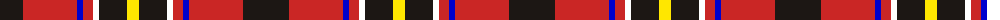

The parent of this is [Hoffman Texas German](/tartans/k/46/r54/b6/r10/w6/k28/y/12/)

This was sourced from register-of-tartans.  It is a [7 stripes tartan](/stripes/stripes7/).

Original link https://www.tartanregister.gov.uk/tartanDetails.aspx?ref=10478

## Thread count
K/46 R54 B6 R10 W6 K28 Y/12

## Palette
Each colour and its ΔE from the base-6 reference it is a variant of.

| Colour | Shade | Base | ΔE (OKLab) |
|---|---|---|---|
| B |  `#0000CD` | B  | 0.15 |
| K |  `#1C1714` | K  | 0.21 |
| R |  `#CA2625` | R  | 0.03 |
| W |  `#FFFFFF` | W  | 0.03 |
| Y |  `#FFE700` | Y  | 0.11 |

# Sample pattern

ID: /variants/k/46/r54/b6/r10/w6/k28/y/12-b0000cd-k1c1714-rca2625-wffffff-yffe700/
